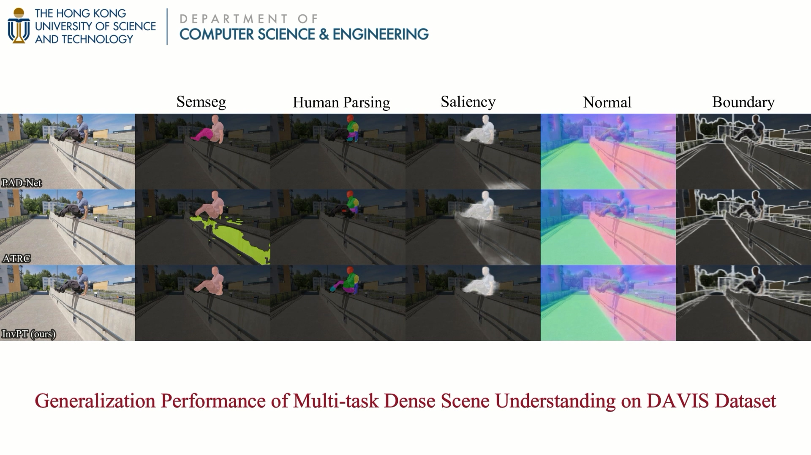

# :fire: ECCV2022 InvPT: Inverted Pyramid Multi-task Transformer for Dense Scene Understanding

##  :scroll: Introduction

This repository implements our ECCV2022 paper InvPT:
> [Hanrong Ye](https://sites.google.com/site/yhrspace/) and [Dan Xu](https://www.danxurgb.net/), [Inverted Pyramid Multi-task Transformer for Dense Scene Understanding](https://arxiv.org/abs/2203.07997). 
> The Hong Kong University of Science and Technology (HKUST)

InvPT proposes a novel end-to-end Inverted Pyramid multi-task Transformer to perform **simultaneous modeling of spatial positions and multiple tasks in a unified framework**. InvPT presents an efficient UP-Transformer block to learn multi-task feature interaction at gradually increased resolutions, which also incorporates effective self-attention message passing and multi-scale feature aggregation to produce task-specific prediction at a high resolution. InvPT achieves superior performance on NYUD-v2 and PASCAL-Context datasets respectively, and **significantly outperforms previous state-of-the-arts**.

# :sunglasses: Demo

[](https://youtu.be/XxSZUkknHII)
To qualitatively demonstrate the powerful performance and generalization ability of our multi-task model *InvPT*, we further examine its multi-task prediction performance  for dense scene understanding in the new scenes. Specifically, we train InvPT on PASCAL-Context dataset (with 4,998 training images) and generate prediction results of the video frames in [DAVIS](https://davischallenge.org/) dataset without any fine-tuning. InvPT yields good performance on the new dataset with distinct data distribution.
**Watch the demo [here](https://youtu.be/XxSZUkknHII)!**

# :tv: News
:triangular_flag_on_post: **Updates** 
- :white_check_mark: July 18, 2022: Update with InvPT models trained on PASCAL-Context and NYUD-v2 dataset!


# :grinning: Train your **InvPT**!

## 1. Build recommended environment
For easier usage, we re-implement InvPT with a clean training framework, and here is a successful path to deploy the recommended environment:
```bash
conda create -n invpt python=3.7
pip install tqdm Pillow easydict pyyaml imageio scikit-image tensorboard
pip install opencv-python==4.5.4.60
pip install setuptools==59.5.0

# An example of installing pytorch-1.10.0 with CUDA 11.1
pip install torch==1.10.0+cu111 torchvision==0.11.0+cu111 torchaudio==0.10.0 -f https://download.pytorch.org/whl/torch_stable.html

pip install timm==0.5.4 einops==0.4.1
```

## 2. Get data
We use the same data (PASCAL-Context and NYUD-v2) as ATRC. You can download the data by:
```bash
wget https://data.vision.ee.ethz.ch/brdavid/atrc/NYUDv2.tar.gz
wget https://data.vision.ee.ethz.ch/brdavid/atrc/PASCALContext.tar.gz
```
And then extract the datasets by:
```bash
tar xfvz NYUDv2.tar.gz
tar xfvz PASCALContext.tar.gz
```
You need to specify the dataset directory as ```db_root``` variable in ```./configs/mypath.py``` inside the ```code``` directory.

## 3. Train the model
The config files are defined in ```./configs```  in the ```code``` directory, the output directory is also defined in your config file.

As an example, we provide the training script of the best performing model of InvPT with Vit-L backbone. To start training, you simply need to go into ```code``` directory and run:
```bash
bash run.sh # for training on PASCAL-Context dataset. 
```
or 
```bash
bash run_nyud.sh # for training on NYUD-v2 dataset.
```
**after specifcifing your devices and config** in ```run.sh```.
This framework supports [DDP](https://pytorch.org/tutorials/intermediate/ddp_tutorial.html) for multi-gpu training.

All models are defined in ```models/``` so it should be easy to **deploy your own model in this framework**.

## 4. Evaluate the model
The training script itself includes evaluation. 
For inferring with pre-trained models, you need to change ```run_mode``` in ```run.sh``` to ```infer```.

### **Special evaluation for boundary detection**
We follow previous works and use Matlab-based [SEISM](https://github.com/jponttuset/seism) project to compute the optimal dataset F-measure scores. The evaluation code will save the boundary detection predictions on the disk. 

Specifically, identical to ATRC and ASTMT, we use [maxDist](https://github.com/jponttuset/seism/blob/6af0cad37d40f5b4cbd6ca1d3606ec13b176c351/src/scripts/eval_method.m#L34)=0.0075 for PASCAL-Context and maxDist=0.011 for NYUD-v2. Thresholds for HED (under seism/parameters/HED.txt) are used. ```read_one_cont_png``` is used as IO function in SEISM.

# 5. Get pre-trained models
To faciliate the community to reproduce our SoTA results, we re-train our best performing models with the training code in this repository and provide the weights for the reserachers.

### Download pre-trained models
|Version | train dataset | google drive | onedrive |
|:-:|:-:|:-:|:-:|
| InvPT_pascal_vitLp16| PASCAL-Context | [google drive](https://drive.google.com/file/d/1r0ugzCd45YiuBrbYTb94XVIRj6VUsBAS/view?usp=sharing) | [onedrive](https://hkustconnect-my.sharepoint.com/:u:/g/personal/hyeae_connect_ust_hk/EcwMp9uUEfdLnQcaNJsN3bgBfQeHHqs2pkj7KmtGx_dslw?e=0CtDfq) |
| InvPT_nyud_vitLp16| NYUD-v2 | [google drive](https://drive.google.com/file/d/1Ag_4axN-TaAZS_W-nFIm4__DoDw1zgqI/view?usp=sharing) | [onedrive](https://hkustconnect-my.sharepoint.com/:u:/g/personal/hyeae_connect_ust_hk/EU6ypDGEFPFLuC5rG5Vj2KkBliG1gXgbXh2t_YQJIk9YLw?e=U6hJ4H) |

### Infer with the pre-trained models
Simply set the pre-trained model path in ```run.sh``` by adding ```--trained_model pretrained_model_path```.
You also need to change ```run_mode``` in ```run.sh``` to ```infer```.

# :hugs: Cite
BibTex:
```
@InProceedings{invpt2022,
  title={Inverted Pyramid Multi-task Transformer for Dense Scene Understanding},
  author={Ye, Hanrong and Xu, Dan},
  journal={ECCV},
  year={2022}
}
```
Please also consider :star2: star our project to share with your community if you find this repository helpful!

# :blush: Contact
Please contact [Hanrong Ye](https://sites.google.com/site/yhrspace/) if any questions.

# :+1: Credits
This repository borrows codes from [MTI-Net](https://github.com/SimonVandenhende/Multi-Task-Learning-PyTorch) and [ATRC](https://github.com/brdav/atrc).

Thanks la pyramide inversée in Louvre for inspiration.


# :business_suit_levitating: License
[Creative commons license](http://creativecommons.org/licenses/by-nc/4.0/) which allows for personal and research use only. 

For commercial useage, please contact the authors. 
